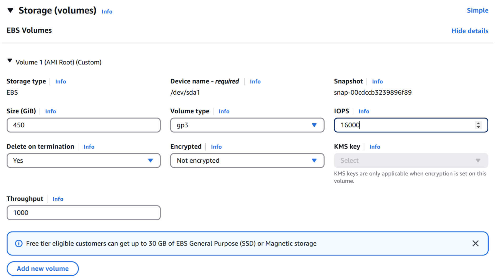

# Fine-Tuning HF Models with `Unsloth` on AWS `g6.xlarge` EC2 instance

This repository demonstrates fine-tuning any Hugging Face model (supported on Unsloth) using the Unsloth framework on an AWS `g6.xlarge` EC2 instance. View the instructions below to launch the EC2 instance, clone this repository and run the example notebook.

**Skip to [problem 1](#problem-1) for what you have to submit for this lab**.

## What is **Unsloth**?

[`Unsloth`](https://unsloth.ai/) is an open-source library designed to accelerate the fine-tuning and training of large language models (LLMs). By manually optimizing compute-intensive operations and crafting custom GPU kernels, Unsloth achieves significant improvements in training speed and memory efficiency without requiring hardware modifications. According to the Unsloth documentation provided [here](https://docs.unsloth.ai/#), it makes finetuning large language models like Llama-3, Mistral, Phi-4 and Gemma 2x faster, use 70% less memory, and with no degradation in accuracy. Unsloth support NVIDIA GPUs from Tesla T4 to H100, and we’re portable to AMD and Intel GPUs.

## Prerequisites

To run the provided Jupyter notebook, follow the steps below to create an EC2 instance where you can clone this repository, set up the conda kernel, install the required packages and run the example notebook.

1. Create an EC2 instance with the `Deep Learning OSS Nvidia Driver AMI GPU PyTorch` AMI and `g6e.2xlarge` instance type. You can see step by step instructions [here](https://aws-samples.github.io/foundation-model-benchmarking-tool/misc/ec2_instance_creation_steps.html).
    - At the time of this writing the AMI used for us-east-1 was ami-067bd563cecc90173.
    - 450GB of gp3 storage with 16000 IOPS and throughput set to 1000.
    

1. SSH to your EC2 instance and clone this repo.

    ```bash
    git clone https://github.com/madhurprash/unsloth-finetune-ec2.git
    cd unsloth-finetune-ec2
    ```

1. Copy the `.env.template` to `.env` and edit it to add your Hugging Face token.  The token is needed to use a gated model, such as the [Llama3.1 8b instruct](https://huggingface.co/meta-llama/Llama-3.1-8B-Instruct) model

    ```bash
    cp .env.template .env
    ```

1. Install `uv` and Python dependencies:

    ```bash
    curl -LsSf https://astral.sh/uv/install.sh | sh
    export PATH="$HOME/.local/bin:$PATH"
    ```

1. Restore Python virtual environment from the pyproject.toml file.

    ```bash
    uv venv --python 3.12 && source .venv/bin/activate && uv pip sync pyproject.toml
    ```

1. Create a conda kernel. This is needed to run the notebook on your EC2 instance:

    ```bash
    uv add zmq
    python -m ipykernel install --user --name=.venv --display-name="Python (uv env)"
    ```

1. Open the JupyterLab notebook to run and select the `Python (uv env)` if not selected automatically (if it is not, refresh the page or close the notebook and open it again and you should see it selected or be able to select it from the drop down).

## Steps to run the solution

1. Open the [`SFT_hf_model_unsloth.ipynb`](SFT_hf_model_unsloth.ipynb) notebook and run all cells. This will train the model, run inference against the model using Unsloth's `FastLanguageModel.for_inference(model)`. If you have provided a valid HF token, this model is also served on Ollama through this notebook and we can run inferences on that as well.

1. In case you are interesting in training your model using `Group Relative Policy Optimization`(GRPO), open [`GRPO_hf_model_unsloth.ipynb`](GRPO_hf_model_unsloth.ipynb) notebook and run all cells.

## Results: EC2 instance utilization metrics & training stats

This notebook also produces results in the form of EC2 metrics. The results can be found in the [`results`](results) directory. The results directory contains the following two files:

1. [`ec2_metrics.csv`](results/ec2_metrics.csv): This file contains instance utilization metrics. For example, the mean GPU utilization, CPU utilization and the memory used up by the instance. These metrics are only collected during the training process. View an example of some of the metrics generated below:

    ```{.csv}
    timestamp,cpu_percent_mean,memory_percent_mean,memory_used_mean,gpu_utilization_mean,gpu_memory_used_mean,gpu_memory_free_mean,gpu_memory_total_mean
    2025-02-21 19:42:37,0.0,2.9,7.651355743408203,0.0,16002.375,29370.312500000004,46068.0
    2025-02-21 19:42:42,1.9079216328354662,3.321088803677962,7.926143636541902,72.13185182101137,16602.57081138804,28770.116622093094,46068.0
    2025-02-21 19:42:47,2.003390286757495,3.410012950457253,7.992933634798297,82.83819711742942,16809.281850116146,28563.40561512593,46068.0
    ```

1. [`training_stats.txt`](results/training_stats.txt): This file logs some of the trainer stats, such as the number of global steps it took to get to a specific training loss, the train runtime, samples per second, steps per second, etc. View an example of running this training on a `g6e.2xlarge` instance:

    ```{.txt}
    Training Statistics:
    Global Steps: 60
    Training Loss: 1.1542

    Metrics:
    - Train Runtime: 107.371 seconds
    - Training Samples/Second: 4.470
    - Training Steps/Second: 0.559
    - Total FLOPS: 1.39e+16
    - Final Train Loss: 1.1542
    ```

## Problem 1

Your task is to follow all the instructions provided above to fine-tune the `Llama3.1-8b` model (all code is provided to you), now create a copy of the `SFT_hf_model_unsloth.ipynb` notebook and call it `problem1.ipynb` and modify it to fine-tune the `meta-llama/Llama-3.2-1B-Instruct` model for the `banking77` dataset which you can download from Hugging Face ([link](https://huggingface.co/datasets/mteb/banking77)). 

1. You would need to update the code to download the `banking77` dataset, and use the fields in that dataset (note that these are different from the ones in the `SFT_hf_model_unsloth.ipynb` notebook).
1. You would also need to update the instructions in the prompt and chat templates as per your task.
1. Lookout for any other parameter that needs to be updated.
1. Run the training for 1 epoch and set the `max_steps` to 600.
1. Once the model is trained, run inference on the following inputs:
    - I see a charge on my credit card statement but I paid on time, why?
    - Do you have a branch in Timbuktu?
    - I lost my card and my replacement card has not arrived.
1. Save the questions and outputs from your fine-tuned model in a file called `problem1_task1.txt`. The `SFT_hf_model_unsloth.ipynb` uses `TextStreamer` you would need to use something else to get the output in a string variable. The file contents should look like:

    ```
    input: I see a charge on my credit card statement but I paid on time, why?
    category: <model output>
    input: Do you have a branch in Timbuktu?
    category: <model output>
    input: I lost my card and my replacement card has not arrived.
    category: <model output>
    ```

Commit and push `problem1.ipynb` and `problem1_task1.txt` to the repo.
